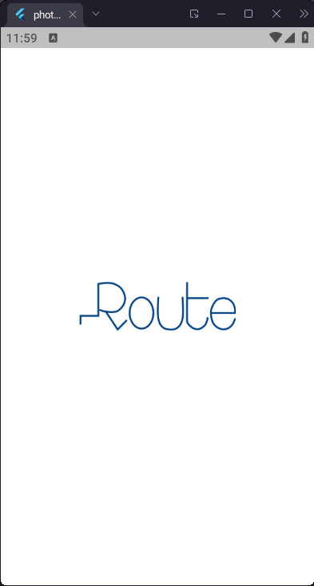
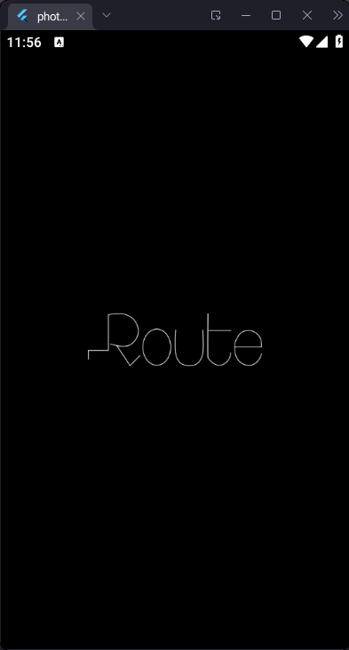
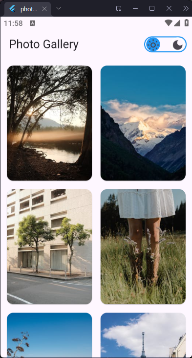
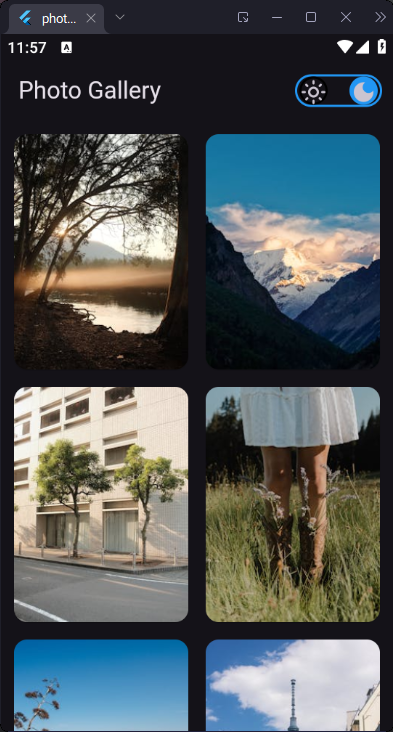
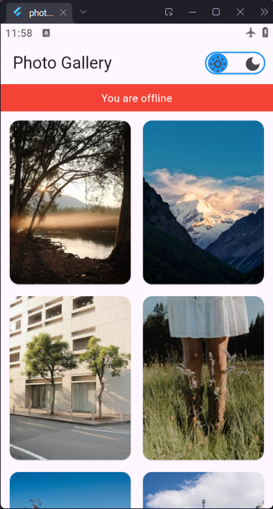
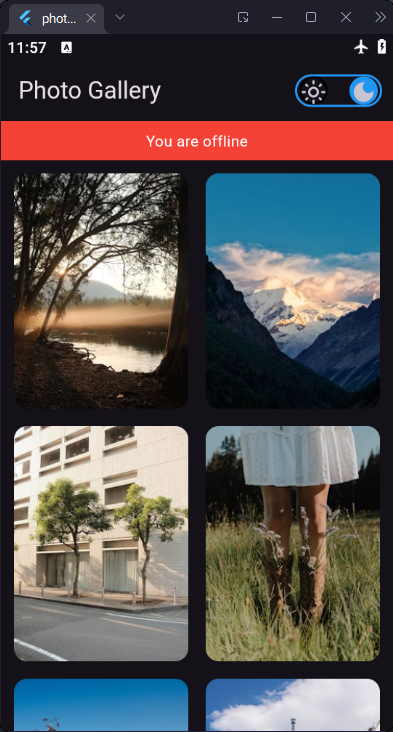
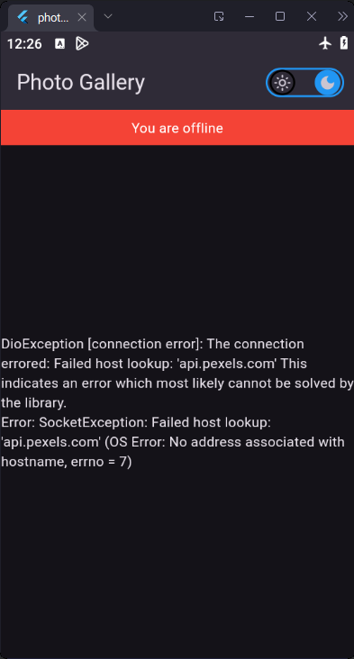

# Photo Gallery App

A Flutter application built to display curated photos from [Pexels API](https://www.pexels.com/api/).  
The app implements **Clean Architecture** with **Offline Caching**, **Infinite Scroll Pagination**, **Dark/Light Themes**, and a **Network Status Indicator**.

---

## **Features**

- **Photo List with Pagination**: Scroll down to load more photos automatically.
- **Offline Caching**: View previously loaded photos even without an internet connection (Hive).
- **Dark/Light Theme**: Switch between themes; preference is saved using SharedPreferences.
- **Network Indicator**: Banner shows current online/offline status in real-time.
- **Splash Screen**: Minimalistic splash with Route logo.
- **Clean Architecture**: Data, Domain, and Presentation layers with Repository Pattern and Dependency Injection.

---

## **Screenshots**

> **Note**: Replace these conceptual descriptions with actual screenshots saved in `screenshots/` folder.

### **Splash Light Mode**
- Shows splash screen in light mode.



---

### **Splash Dark Mode**
- Shows splash screen in dark mode.



---

### **Photo List (Online - Light Mode)**
- Photos fetched from API with light theme.



---

### **Photo List (Online - Dark Mode)**
- Photos fetched from API with dark theme.



---

### **Photo List (Offline/Cached - Light Mode)**
- Cached photos shown in light theme (no internet).



---

### **Photo List (Offline/Cached - Dark Mode)**
- Cached photos shown in dark theme (no internet).



---

### **Loading State**
- Displays loading spinner while fetching photos.


---

### **Error State**
- Shows error message when API call fails (e.g., no cached data).



---

### **Network Status Indicator**
- Red banner appears at the top when offline.


---

## **App Architecture**

This app follows **Clean Architecture** principles, separating concerns into three main layers:

### **1. Presentation Layer**
- **Purpose**: Handles UI and state management.
- **Components**:
    - `PhotoCubit` and `PhotoState` for managing photo list state.
    - `NetworkCubit` for monitoring connectivity.
    - `ThemeCubit` for theme switching and persistence.
    - `PhotoListScreen` (main UI) and `CustomSplashPage`.

---

### **2. Domain Layer**
- **Purpose**: Encapsulates business logic and rules.
- **Components**:
    - `PhotoEntity` (core photo data).
    - `PhotoRepository` (abstract interface).
    - `GetPhotosUseCase` (business logic for fetching photos).

---

### **3. Data Layer**
- **Purpose**: Manages data sources (Remote API + Local Cache).
- **Components**:
    - **Remote**: `PhotoApiService` (Retrofit/Dio).
    - **Local**: `PhotoLocalDataSource` (Hive for caching).
    - `PhotoRepositoryImpl`: Combines Remote and Local logic.

---

## **Project Structure**

lib/
  core/
    constants/         # Colors, Strings
    utils/             # Helpers
    di/
     injection.dart
     network_module.dart
  features/
    home/
      data/
        models/
        data_sources/
        repositories/
      domain/
        entities/
        repositories/
        usecases/
      presentation/
        cubit/
        screens/
    splash/
      cubit/
      screens/
  main.dart

## Setup Instructions

1. **Clone the repo**
```bash
git clone <repository-url>
cd photo_gallery_app

Add your Pexels API Key
In network_module.dart, set your API key:
     dio.options.headers['Authorization'] = 'YOUR_API_KEY';
Get packages:
     flutter pub get
Generate code (Retrofit, Injectable, Hive):
     flutter pub run build_runner build --delete-conflicting-outputs
Run app:
     flutter run
```

## Packages Used

- State Management: flutter_bloc (Cubit)
- Networking: dio, retrofit, json_serializable
- Local Storage: hive, hive_flutter
- Connectivity: connectivity_plus, internet_connection_checker
- Persistence: shared_preferences
- Image Caching: cached_network_image


